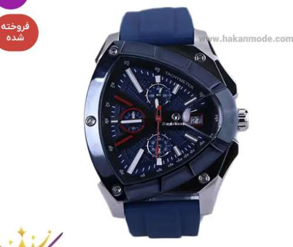

# Image Search Fine Tuning

## Silhouette Augmentation
Take the product image → convert to a black & white silhouette:

object = white

background = black

This removes texture/color and leaves pure shape.

## Edge Augmentation

