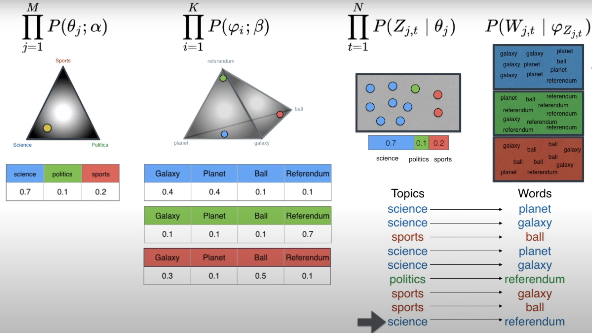
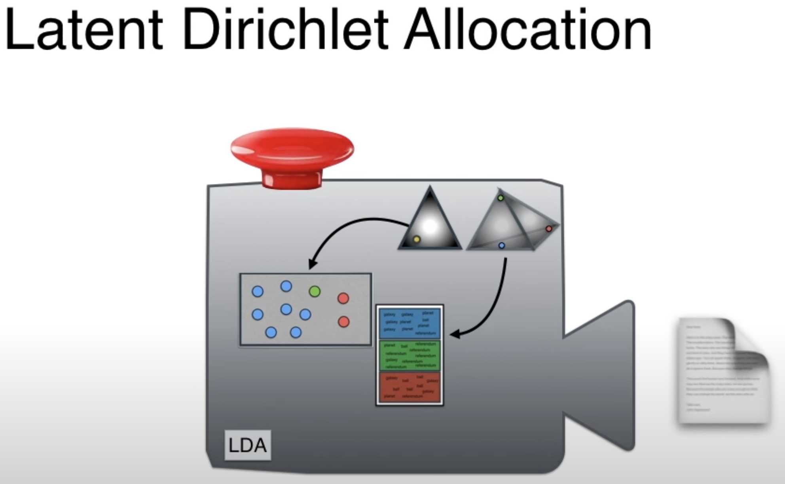
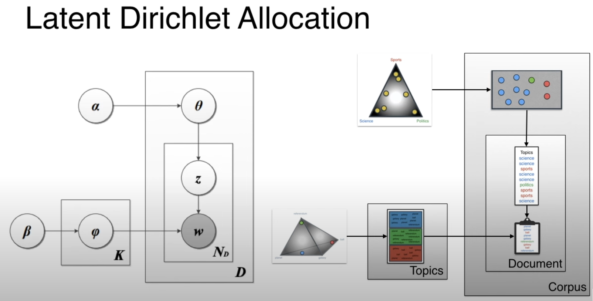

# Latent Dirichlet Allocation

## Problem
We have a few corpuses and we want to find out their topics.

LDA takes a geometric approach.

In the image above, the corners are topics and the points inside are DOCUMENTS.

This formula calculates the probability that a particular document comes out of the machine

From alpha we get theta, from beta we get thai.

We combine zed and thai to obtain a list of words, one word per topic. We concatenate these words to obtain a document and then we do this as many times as number of documents in the corpus.
