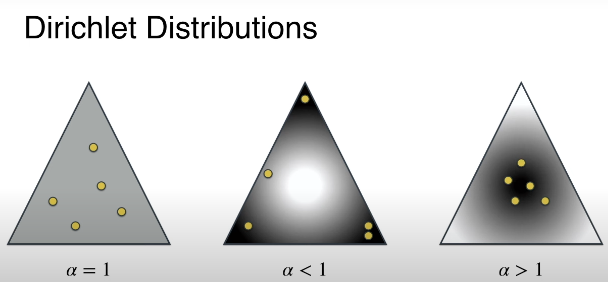
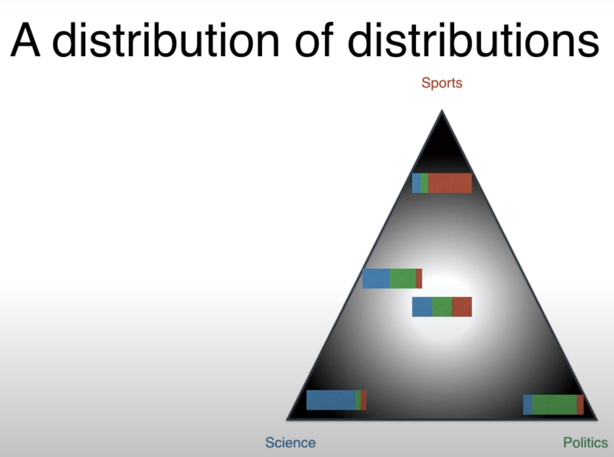

# Latent Dirichlet Allocation

## Problem
We have a few corpuses and we want to find out their topics.

LDA takes a geometric approach.

In the image above, the corners are topics and the points inside are DOCUMENTS.

