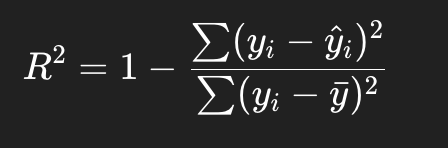

# MSE
It penalizes larger errors more heavily because of the squaring.

Sensitive to outliers

# MAE
- More robust to outliers than MSE.
- Has the same unit as the target variable (makes interpretation easier).

# R² Score (Coefficient of Determination)
R² tells you how much of the variance in the target variable is explained by your model.

Interpretation

- 𝑅2=1: perfect predictions
- 𝑅2=0: model predicts no better than the mean
- 𝑅2<0: model is worse than predicting the mean

# Cross Entropy
Used for:
→ Classification tasks (predicting discrete categories like “electronics”, “clothing”, etc.)

What it measures:
→ How far the predicted probability distribution is from the true class distribution.

yi: one-hot true label

Where it’s used:

- Classification (softmax output)
- Contrastive learning (after computing similarities + scaling + softmax)

Key property:

It’s sensitive to probabilities, not raw vector similarity.

## Multi-Label Classification
Softmax (used in normal cross entropy):

→ Forces all probabilities to sum to 1

→ Interprets labels as mutually exclusive

That’s wrong for multi-label, because you can have multiple true labels. we treat each class as an independent yes/no (binary) problem.

Each class has its own sigmoid output, each class independently gets a loss, then we sum (or average) across all classes

| Setting          | Goal                           | Activation              | Loss                     |
| ---------------- | ------------------------------ | ----------------------- | ------------------------ |
| **Single-label** | Pick *one* best class          | **Softmax**             | Cross Entropy            |
| **Multi-label**  | Predict *all* relevant classes | **Sigmoid (per class)** | **Binary Cross Entropy** |

# Cosine Similarity
What it measures:

→ The angle between two vectors — not their magnitude.

Key property:

It’s a distance metric, not a loss function by itself.

# logit scale or (temperature)
When you use cosine similarity to compare embeddings (e.g., between queries and products), the values usually lie between -1 and 1.
That’s a pretty small range — so when you apply softmax on those similarities, all the outputs look too similar (not “sharp” enough).

To fix that, we scale the similarities before softmax

| τ (temperature)     | Effect on softmax                                                | Interpretation                                         |
| ------------------- | ---------------------------------------------------------------- | ------------------------------------------------------ |
| **< 1** (e.g. 0.05) | **Sharper** — increases contrast between positives and negatives | Model becomes more confident (stronger peaks)          |
| **> 1** (e.g. 2.0)  | **Softer** — reduces contrast                                    | Model becomes less confident, spreads probability mass |
| **= 1**             | Neutral (default)                                                | Normal softmax                                         |

## Example

| Product       | Cosine sim |
| ------------- | ---------- |
| Correct match | 0.8        |
| Wrong match A | 0.6        |
| Wrong match B | 0.5        |

Without scaling (τ = 1):

softmax([0.8,0.6,0.5])⇒[0.42,0.34,0.24]

Model says the correct match is only 42% confident.

With τ = 0.05:

softmax([16,12,10])⇒[0.999,0.0002,0.00005]

Now the distribution is very sharp — the correct match is clearly dominant.

So, dividing by a small τ (< 1) effectively amplifies differences between similarities.

In practice, many implementations (e.g., CLIP, Sentence-BERT) don’t divide by τ, but instead learn a scaling parameter 

s=1/τ

If the model learns that all pairs are too close together, it increases 𝑠 (making the softmax sharper).

If things are too peaky and unstable, it decreases 𝑠

“temperature” (τ) and “logit scale” (s) are inverses of each other

Purpose: Makes softmax more discriminative over cosine sims, improves contrastive learning stability
