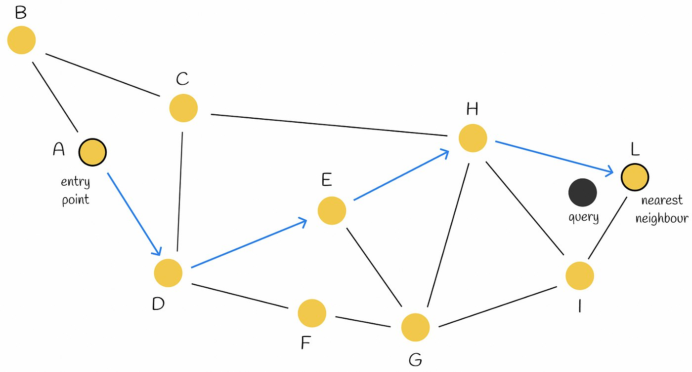
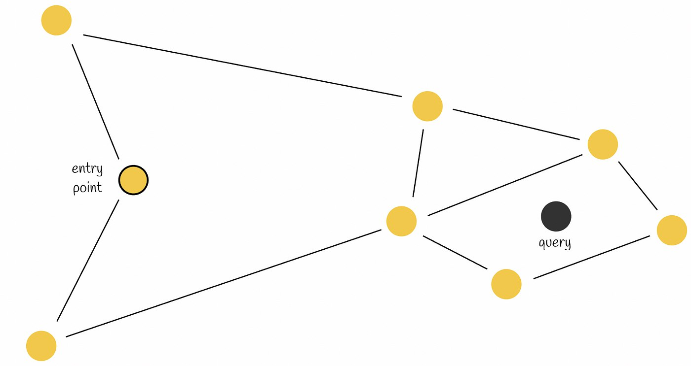
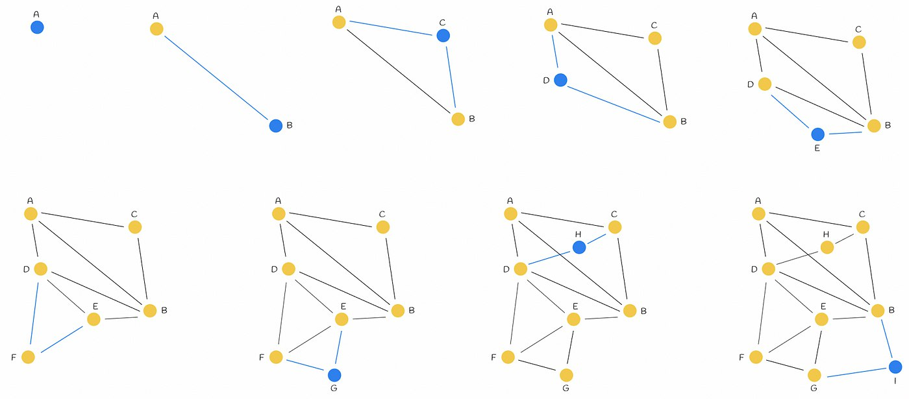
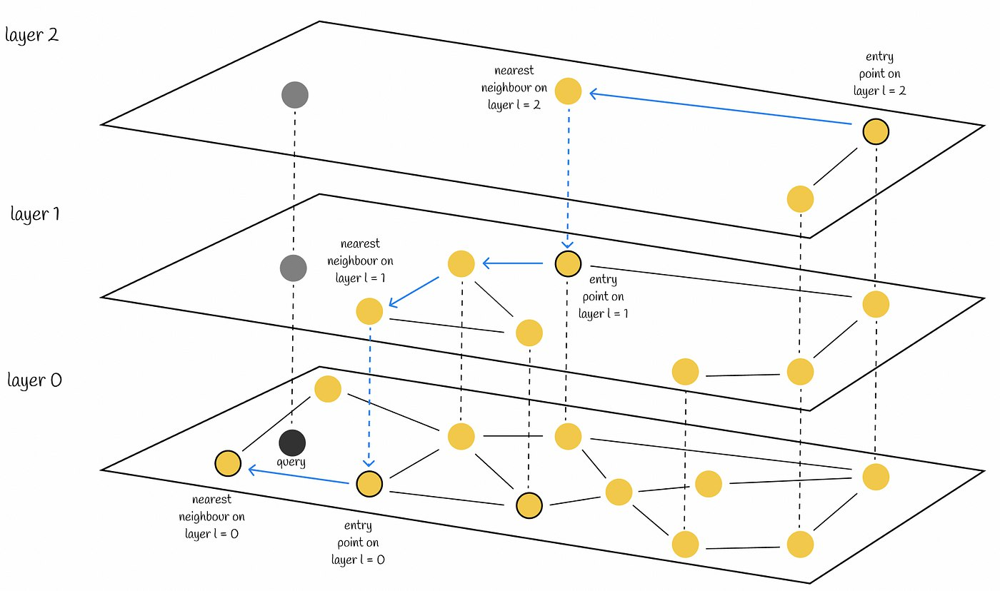

# Digikala
## Similarity Search, Hierarchical Navigable Small World (approximate search of nearest neighbors)

Construct efficient multy-layered graphs to boost speed in massice volumes of data

The main idea of HNSW is to construct such a graph where a path between any pair of vertices could be traversed in a small number of steps.

All people are six or fewer social connections away from each other (six handshakes rule)

### Skip lists
Skip list is a probabilistic data structure that allows inserting and searching elements within a sorted list for O(logn) on average.

It's constructed by several layers of linked lists. The lowesr layer has all the elements. When moving to higher levels, the number of skipped elements increases (decreasing the number of connections)

Search for the value starts from the highest level and compares it with its next element:

If the value is less or equal to the next elemnt, proceeds to its next element otherwise, descend to the lower layer and repeat the same. At the end the algorithm finds the desired node.

If an element appears in layer i, then the probability that it will appear in layer i + 1 is equal to p (usually set to 0.5 or 0.25). 

This process is much faster than the normal linear search in the linked list. In fact, HNSW inherits the same idea but instead of linked lists, it uses graphs.

### Navigable Small World
Navigable small world is a graph with polylogarithmic T = O(log^k(n)) search complexity which uses greedy routing. Routing refers to the process of starting from low-degree vertices and ending with high-degree vertices. Since low-degree vertices have very few connections, the algorithm can rapidly move between them to efficiently navigate to the region where the nearest neighbor is likely to be located. Then it gradually zooms in and switches to high-degree vertices.

#### Search

Node A is used as an entry point. Node D is closer to the query than B. Then node E is the closest neighbour to the query, so we move to E. Finally the search process will lead to node L. Since all neighbours of L are located further from the query than itself, we stop the algorithm and return L as the answer to the query.

Early stopping is one of the problems of the algorithm. It occurs especially at the beginning of the search procedure when there are no better neighbour nodes than the current one. This might happen when the starting region has too many low-degree vertices.

the accuracy can be improved by using several entry points

#### Construction
Shuffle dataset points and insert them one by one in the greaph. New node is linked by edges to the M nearest vertices to it.

M = 2

In most scenarios, long-range edges will likely be created at the beginning phase of the graoh construction. They play an important role in graph navigation.

Links to the closest neighbours of the elements inserted in the beginning of the construction later becomes bridges between the network hubs that keep the overall graph connectivity and allow the logarithmic scaling of the number of hops during greedy routing.

### HNSW
HNSW is based on the same principles as skip list and navigable small world.

#### Search

#### Construction
##### Choosing the maximum layer
Every node is randomly assigned an integer I indicating the maximum layer at which this node can presents in the graph. The authors select I random;y for each node with an exponentially decaying probability distribuion normalized by the non-zero multiplier mL (mL = 0 results in a single layer). Normally, the majority of I values should be equal to 0.

To achieve the optimum performance advantage of the controllable hierarchy, the overlap between neighbours on different layers (i.e. percent of element neighbours that are also belong to other layers) has to be small.

##### Candidate Selection Heuristic
The naive approach takes M closest candidates. Nevertheless, it is not always the optimal choice.

Imagine a graph with the structure in the figure below. There are three regions with two of them not being connected to each other. As a result, getting, for example, from point A to B requires a long path through another region. It would be logical to somehow connect these two regions for better navigation.

